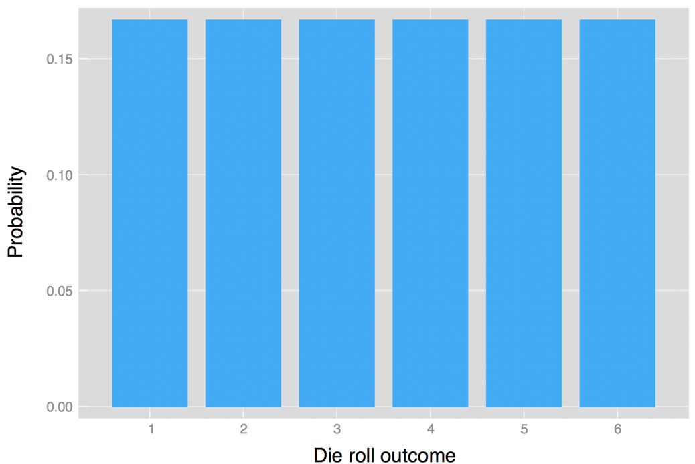
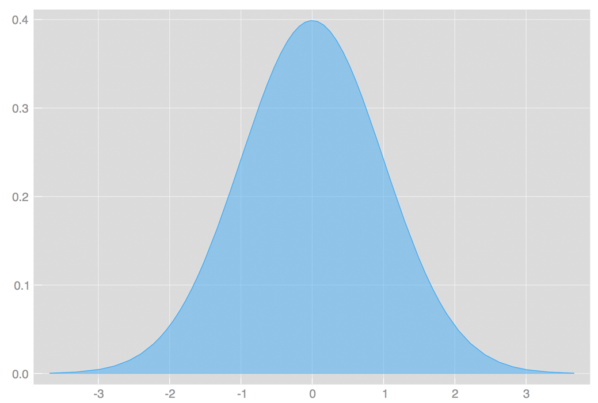
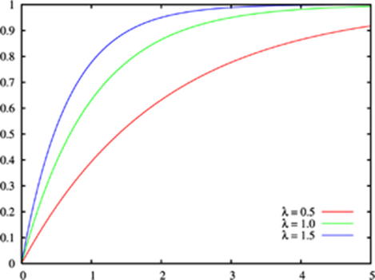

https://towardsdatascience.com/probability-concepts-explained-probability-distributions-introduction-part-3-4a5db81858dc

a **random variable** is a variable whose value is the outcome of a random event

A **probability distribution** is a list of all of the possible outcomes of a random variable along with their corresponding probability values.

When we use a probability function to describe a discrete probability distribution we call it a **probability mass function (súlyfüggvény)**

When we use a probability function to describe a continuous probability distribution we call it a **probability density function (sűrűséggfüggvény)** (commonly abbreviated as pdf). 

**Cumulative distribution function (eloszlásfüggvény)**

F(x) = P(x < x) 

or

F(x) = P(x <= x)

 
