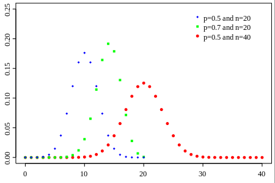
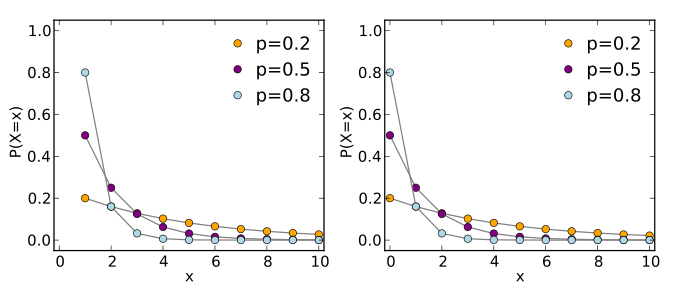

https://en.wikipedia.org/wiki/List_of_probability_distributions#Continuous_distributions

A **Bernoulli trial** (or **binomial trial**) is a random experiment with exactly two possible outcomes, "success" and "failure", in which the probability of success is the same every time the experiment is conducted.

**Binomial distribution** (with n, k parameters):  n Bernoulli trial with p probability of success. P(k) is the probability k experiment succeeded.

**Geometric distribution**: The probability distribution of the number X of Bernoulli trials needed to get one success, supported on the set { 1, 2, 3, ... }

or

The probability distribution of the number Y = X − 1 of failures before the first success, supported on the set { 0, 1, 2, 3, ... }

